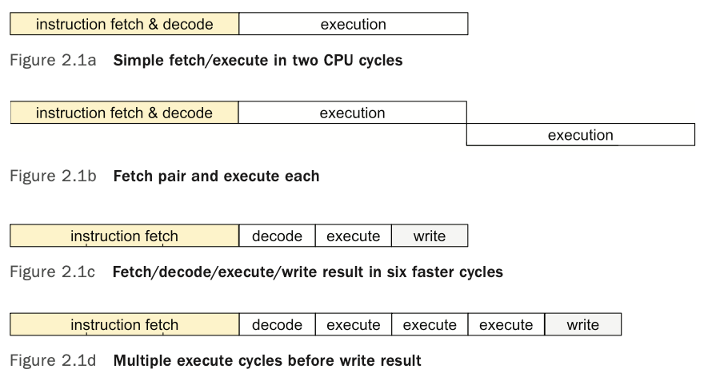
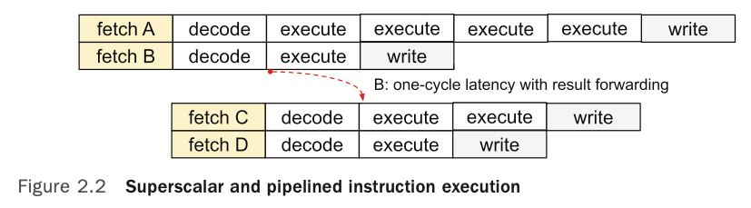
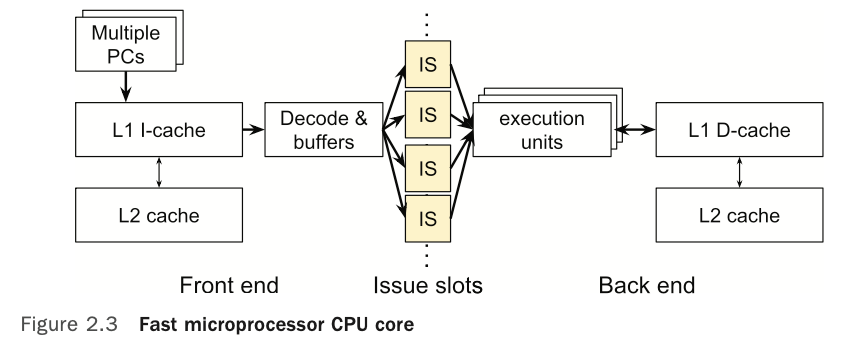
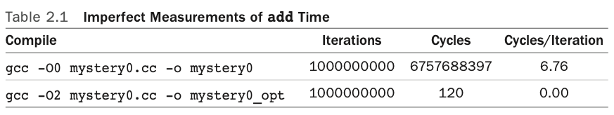

# chapter 2 - measuring cpus

Terms
- `cpu time`: how long real computer instructions like `add` take
- instruction fetch
- cache memory
- time bases
- loop overhead
- compiler optimization
- loop unrolling
- dead code: code never used elsewhere in the program. Typically removed by compiler.
- dependent calculation
- speedup techniques
  - cpu and memory clocks decoupled
  - multiple memory banks
  - multiple data registers
  - multiple instructions per word
  - instruction pipelining
  - multiple execution units
  - speculative execution
  - multiple instruction issue
  - out-of-order execution
  - cache memory
  - paged virtual memory
  - simultaneous multithreading

Summary
- Some software performance issues are imaginary, revealed by mistaken measurements. Others are real but hidden by mistaken measurements. 
-> `make estimate of expected performance`
- Choose your time base carefully and understand its limitations.
- Estimate what you expect to see.
- Compare your measurements against expectations.
- There is always learning in the discrepancies.
- Software that accidentally defeats some chip speedup mechanism can run unexpectedly slowly.

---





In image below, instruction execution environment in modern cpu is complex with many speed up
mechanisms (see terms section).

Software which cannot use these speedup mechanisms can run unexpectedly slowly.



## Measuring add instruction

Ways of measuring `add` instruction latency
``` 
# failed badly in modern cpus
Read the time
    Execute an add instruction
Read the time Subtract

# better for average time per add, maybe far from single add latency
Read time 
    Execute N adds
Read time
Subtract and divide by N
```



```
# unoptimized compilation
gcc -O0 mystery0.cc -o mystery0 
./mystery0
# 1,000,000,000 iterations, 6,757,688,397 cycles, 6.76 cycles/iteration
# 6.76 cycles including loop-overhead

# optimized compilation
gcc -O2 mystery0.cc -o mystery0_opt 
./mystery0_opt
# 1000000000 iterations, 120 cycles, 0.00 cycles/iteration

# final version
# -fno-tree-reassoc to disable compiler rewriting of calculation
gcc -O2 -fno-tree-reassoc mystery1_all.cc -o mystery1_all_opt
# addq 1000000000 iterations, 1136134399 cycles, 1.14 cycles/iteration 
# mulq 1000000000 iterations, 3012984427 cycles, 3.01 cycles/iteration 
# divq 1000000000 iterations, 31808957519 cycles, 31.81 cycles/iteration 
# fadd 1000000000 iterations, 4025330656 cycles, 4.03 cycles/iteration 
# fmul 1000000000 iterations, 4022046375 cycles, 4.02 cycles/iteration 
# fdiv 1000000000 iterations, 14576505981 cycles, 14.58 cycles/iteration
```

```assembly
# mystery0.cc compiled optimized, where does the loop go?

# gcc optimizer constant-folded all billion increment of 1s into a const of 1Billion
# precomooputed at compile time.
rdtsc               # read timestamp counter
movq %rax, %rcx     # move quadword rax to rcx
salq $32, %rdx      # shift left quadword rdx (64 bits)
orq %rdx, %rcx      # or rdx, rcx

rdtsc
pxor %xmm0, %xmm0
movq stdout(%rip), %rdi 
salq $32, %rdx
movl $1, %esi
orq %rdx, %rax
```

To have a correct add instruction measurement, watch out
1. standard compiler optimization removes dead code.
2. make sure each measured instruction is dependent on result of previous one to 
measure `execution latency` instead of `issue rate`.
   - compiler can reorder computations for associative operators (e.g. + and *)

lesson: watch out what you actually measure as it is easy to measure other things
different than what you want
- memory access time
- compiler smartness
- not measuring anything at all (compiler removes the code)


## Exercises

```bash
gcc -O0 mystery1.cc -o mystery1_unoptimized
./mystery1_unoptimized

gcc -O2 mystery1.cc -o mystery1_optimized
./mystery1_optimized
```