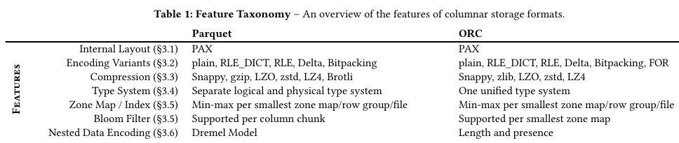
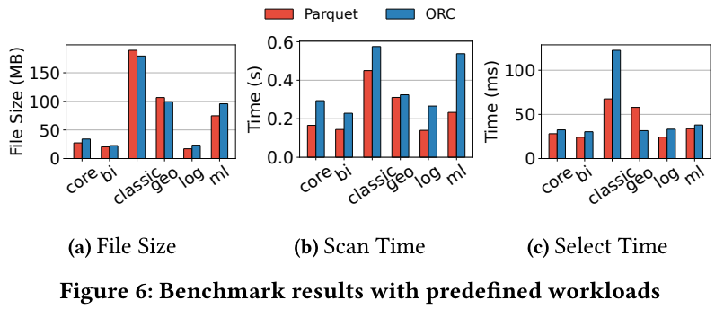
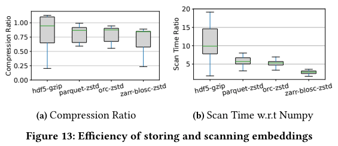
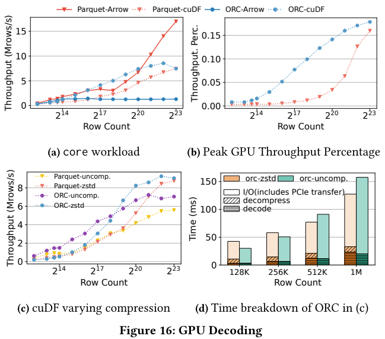

# An Empirical Evaluation of Columnar Storage Formats

Goal: providing insights for next-gen columnar storage format by 
- analyzing Parquet, ORC in different design aspects with a feature taxonomy.
- a benchmark to stress-test them on different workloads.
- discussing their good and bad design decisions for modern hardware and data workloads through benchmark metrics.

Findings
1. Parquet ~ ORC: no clear winner
2. real world datasets has mostly small cardinality (# distinct values)
    -> int encoding algo is important.
3. modern hardware: faster and cheaper storage, bottleneck shifted storage -> compute
   - faster decoding to save compute > better compression to save IO bandwidth
4. extra support data structures (zone maps, Bloom Filters,...) is good as it traded
cheap space for less compute.
5. existing formats are `not good` for machine learning and GPU decoding.

Lessons for future formats
1. use a lot of dict encoding like in Parquet.
2. keep encoding scheme simple.
3. default to no block compression and compute-intensive encodings, optional when justified in edge cases due to shifting bottleneck storage -> compute in processing.
4. metadata layout should be centralized and good for random-access to support
wide tables in ML training. size of unit IO block should be optimized for 
high-latency cloud storage.
5. trade off more storage for faster compute by having more indexing, filtering structures.
6. reduce translation overhead by designing nested data model aligning to memory format e.g. Apache Arrow.
7. have better metadata organization and more effective indexing to support wide-table
projections and low-selectivity selections better in ML workloads.
8. consider GPU decoding efficiency: enough parallel data blocks, parallelize algo, etc.

Good design decisions
- dict encoding by default
- int encoding: decoding speed > compression ratio
- making block compression optional
- using redundant support data structures (bloom filters, etc.)

Not good designs for ML and GPU
- not good for projects of thousands features in ML training
- low-selectivity selection during top-k similarity search in the vector embeddings
- not provide enough parallel units to fully use GPU
- stronger compression is preferred in GPU due to bigger IO overhead > CPU

Feature Taxonomy

Benchmark 
- NDV ratio (number distinct values)
- null ratio
- value range
- sortedness
- skew pattern

## 5-discussing benchmark results 

### 5.1-experiment setup
### 5.2-result overview
### 5.3-encoding analysis
### 5.4-block compression
### 5.5-wide table projection
### 5.6-index and filter
### 5.7-nested data model

### 5.8-machine learning workloads

analyzed aspects
1. vector embeddings compression ratio and deserialization performance
2. integration with vector search pipeline
3. unstructured data storage

ML data
- raw data (urls, binary, images, text, etc.)
- metadata (tags, image dims, etc.)
- vector embedding: vector of floating-points for similarity search.

patterns
- [storing all data in Parquet](https://huggingface.co/docs/datasets-server/quick_start#access-parquet-files)
- ml apps build separate vector indexes from Parquet to speed up sim-search.

- Figure 13a: none of the four formats has good compression with vector embeddings
- Figure 13b: scan is a lot slower than disk numpy format due to not enough parallelism

### 5.9-gpu decoding

- 16a
  - higher decoding throughput ORC-cuDF > Parquet-cuDF because 
    - ORC has more independent blocks to better utilize GPU massive parallelism.
    - smallest zone map in ORC maps to fewer rows than Parquet.
  - decoding throughput of Parquet-Arrow scales with more rows in file because
    - more row groups to leverage for multicore parallel decoding with async I/O
    - arrow impl for ORC does not support parallel-read
- 16b
  - not parallel integer encoding algo in Parquet/ ORC (e.g., hybrid RLE + Bitpacking)
  - all threads must wait for first thread to scan entire data block to obtain offsets in input and output buffers.
- 16c: compression benefit when there are enough rows in the files (i.e., enough data to leverage GPU parallelism).
- 16d: IO time (incl. PCI transfer) takes most time in scan -> strong block compression is good.

