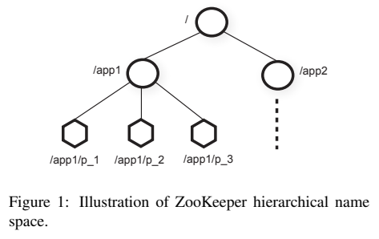

# Zookeeper

## Learning Questions
> Distributed system coordination services like `Google Chubby` existed before `Zookeeper`. Why did Zookeeper need to be built? What problems will it solve that the others cannot?
- Custom coordination mechanism. Existing services provide only a predefined set of coordination primitives/ mechanisms. Zookeeper allow clients to create their own by offering a more generic APIs: hierarchical namespace like filesystem, znodes and watches.
- `Damage perimeter`. Existing services use blocking primitives like locks where slow or faulty clients can affect fast, normal clients.
- `Wait-free data objects`. Zookeeper chooses the trade-off of lock-free for a more relaxed consistency guarantee to avoid the above problem.

> What are the main APIs that Zookeeper provide to client to enable above features?
1. `create()` znode in a namespace
2. `delete()` znode from a namespace
3. `exists()` check if znode exists at a specified path

> What are the functional requirements of Zookeeper?
- design a service to coordinate (distributed) processes.
- client-server API must let clients create custom coordination primitives. (not giving them a predefined set e.g. locking)

> What are the non-functional requirements of Zookeeper?
- highly available: one process in the cluster down does not affect the cluster.
- scalable: more load can be handled by adding more nodes.

> What are the main design decisions and why?
- Client requests are executed in FIFO mode
- Write requests are linearizable

## Zookeeper and Kafka
> If Zookeeper is built according to those reasons, why is `Kafka` removed it as a dependency?
- Pros
  - Simplifying Architecture, Deployment, Operations
  - Centralizing Security and ACL Management
  - single-node mode for Kafka is possible
- Cons
  - complexity in migration, new operational model.
  - compatibility with existing clients working with Zk directly.

> What are the use cases of Zookeeper in Kafka?
1. Cluster Membership Management
   - Zookeeper stores all brokers in the cluster.
   - when a broker starts, it registers itself in Zookeeper.
   - why? to keep track of which brokers are in the cluster to manage health and scalability.
2. Topic Configuration Management
3. Leader Election for Partitions
4. Storing Access Control Lists (ACL)
5. Storing Quota Management

##  Diagrams

### From [Zookeeper paper](https://www.usenix.org/legacy/event/atc10/tech/full_papers/Hunt.pdf)

### From [educative system design, Zookeeper introduction](https://www.educative.io/courses/grokking-the-principles-and-practices-of-advanced-system-design/introduction-to-zookeeper)

## References
- [KIP-500: Replace ZooKeeper with a Self-Managed Metadata Quorum](https://cwiki.apache.org/confluence/display/KAFKA/KIP-500%3A+Replace+ZooKeeper+with+a+Self-Managed+Metadata+Quorum)